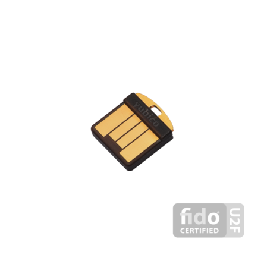
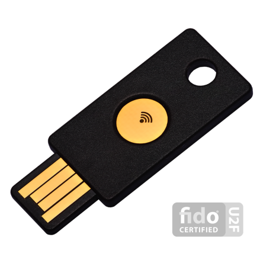
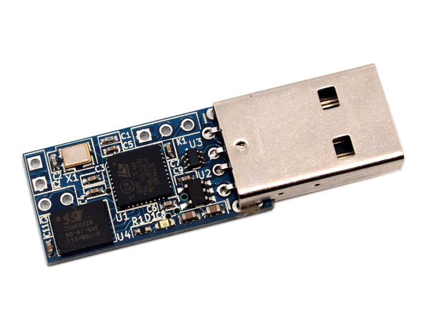
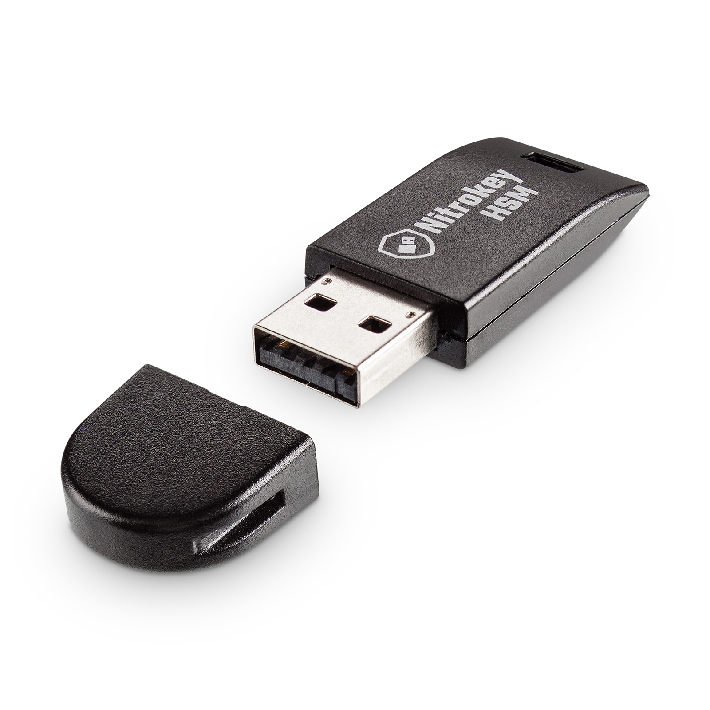
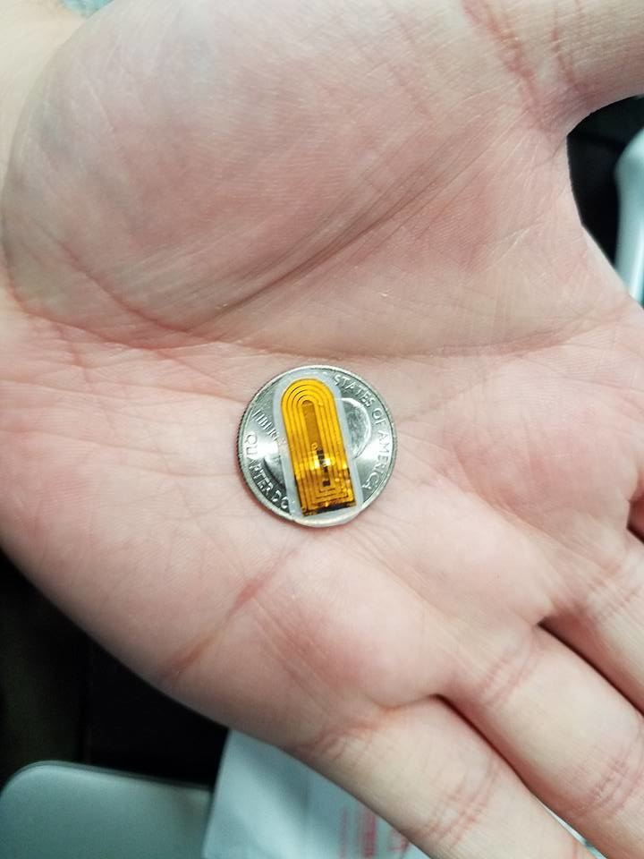

# Devices

## YubiKey

A YubiKey is a Security Token produced by Yubico and well audited by the community and large organizations such as the US Department of Defense, Facebook and Google.

They are currently the most mature general-purpose Security Token solution and are suitable for most users.

The current recommended YubiKeys (depending on use case) are:

### YubiKey 4 Nano

#### Notes
 * Not designed to be frequently removed (will damage it).
 * Can be left in a laptop or desktop (user must be mindful to lock device if unattended).
 * Suitable for the widest range of use cases: FIDO U2F, TOTP, HTOP, GPG, SSH, etc.
 * Can be configured to require physical touch for all operations.
 * Source code is entirely closed source and maintained by Yubico and partners.

### YubiKey 4

#### Notes
 * Fits on keychain, portable and suited for use with many systems.
 * Can be used on Android devices via USB OTG.
 * Sticks out of laptop and generally must be removed before placing on lap or in bag.
 * Suitable for the widest range of use cases: FIDO U2F, TOTP, HTOP, GPG, SSH, etc.
 * Can be configured to require physical touch for all operations.
 * Source code is entirely closed source and maintained by Yubico and partners.

### YubiKey Neo

#### Notes
 * Fits on keychain, portable.
 * Sticks out of laptop and generally must be removed before placing on lap or in bag.
 * Can be used on Android devices via NFC using apps such as Yubico Authenticator, OpenKeychain, and Android Password Store.
 * Only supports 2048-bit RSA encryption and should not be trusted for highly-sensitive use cases such as production SSH.
 * Core applets are open source and audited by many third parties.
 * Can NOT be configured to require physical touch for all operations and should be considered for NFC use only.
 * Should be considered an optional companion to a YubiKey 4 or YubiKey 4 Nano, but not as a standalone solution.

### GnuK

The GnuK is a fully open source and well audited GPG smartcard that is suitable for all typical GPG workflows such as SSH, code/binary/email signing, encryption, etc.

It does not (currently) support features like U2F and HTOP/TOTP, making it unusable for Second Factor Authentication (2FA) in most services.

It also does not support the requirement of a physical touch for activation which means users must physically remove or digitally lock the key after each use.

Though many GnuK devices are in development, currently the only device available to consumers is the FST-01.

See: [http://wiki.seeedstudio.com/wiki/FST-01]

### Nitrokey

The Nitrokey and Nitrokey Pro series of devices are STM32 HSMs that boast full compatibility with all YubiKey 4 features with the exception of physical touch while additionally being fully open software and hardware.

Contrary to what their website claims, these should not be considered for general use yet. They are currently undergoing rounds of security audits that have already found critical hardware flaws, but these devices may be a strong contender to the YubiKey in the near future.

See: [https://www.nitrokey.com/]

### VivoKey

The VivoKey is an NFC-only device designed to cover the bulk of use cases of the YubiKey Neo while also having space for general user-supplied applications such as transit pass emulation via the Fidesmo platform. It is Paralyne-C coated and on a flexible PCB intended for implantation and is currently in human trials.

For people who are not as into scalpels, it would of course be possible to insert such a device into a watch band or bracelet.

See: [http://vivokey.com/]
